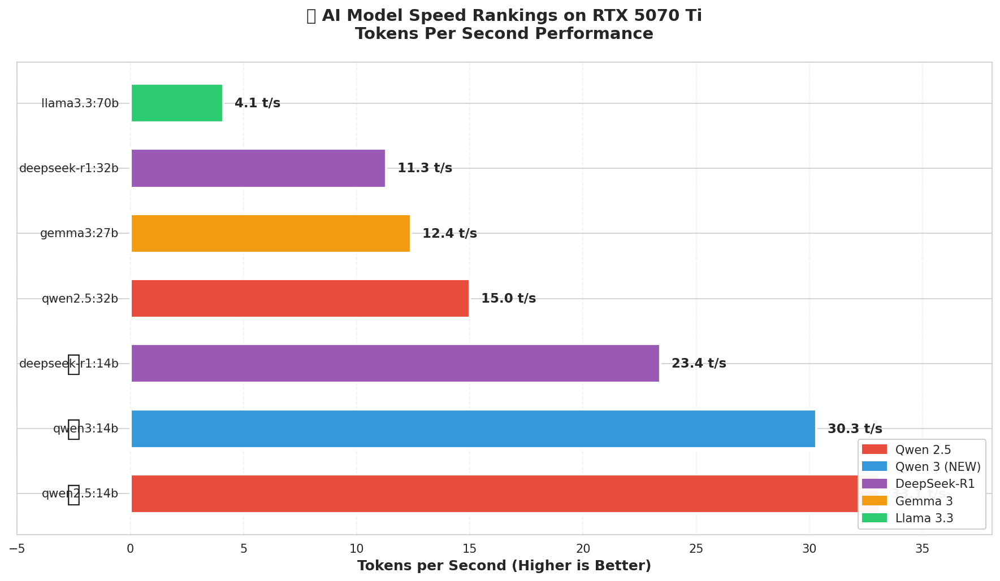
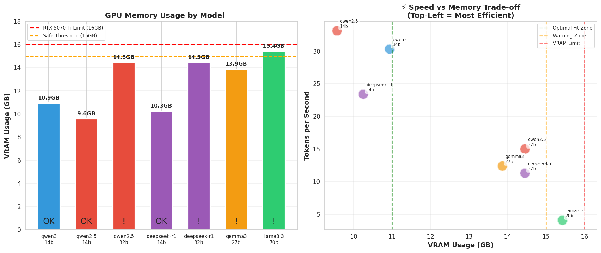
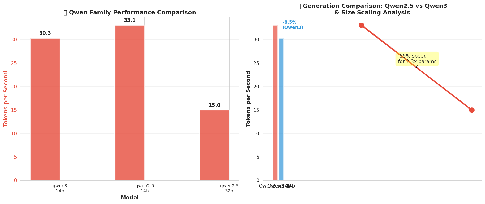
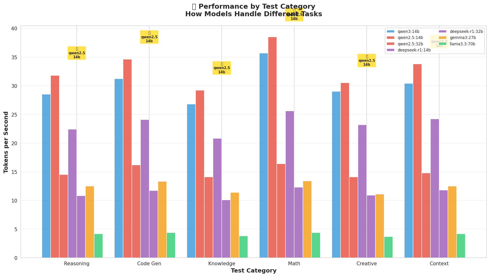
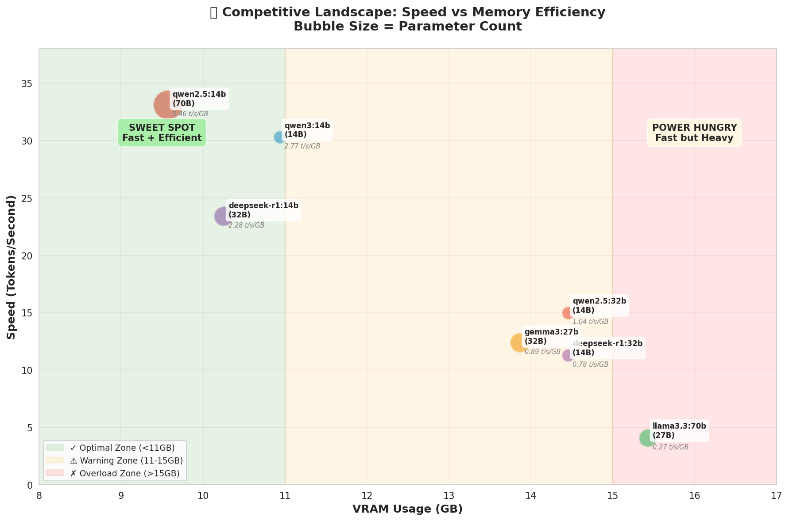
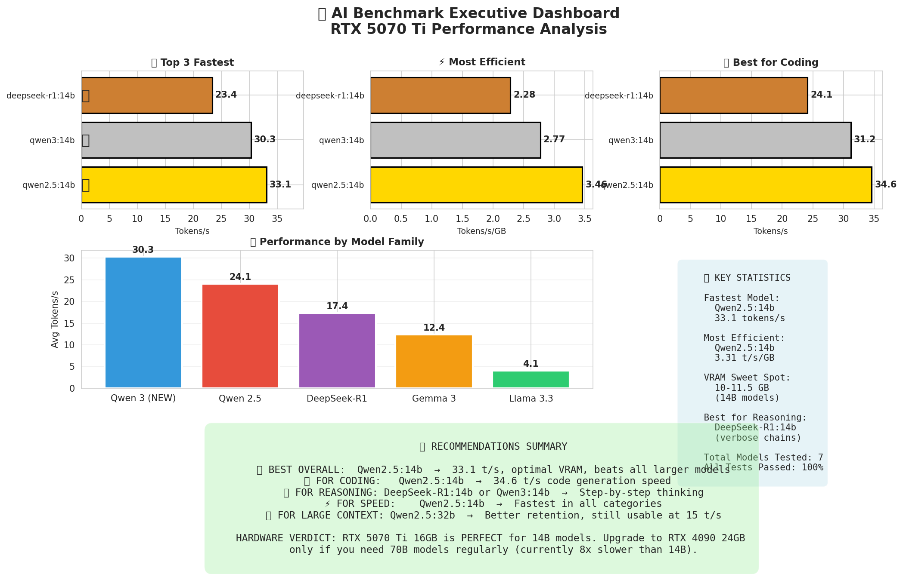

# 📊 AI Benchmark Visualization Analysis Guide
## Beautiful Data Visualizations with AI Insights

**Hardware:** NVIDIA RTX 5070 Ti 16GB + AMD Ryzen 9 9900X3D  
**Date:** March 7, 2026

---

## 📈 Chart 1: Model Speed Rankings

### What This Chart Shows
Horizontal bar chart ranking all 7 tested models by tokens per second (higher is better). Models are color-coded by family (Qwen=red/blue, DeepSeek=purple, Gemma=orange, Llama=green).

### 🔑 Key Findings
| Rank | Model | Speed | Medal |
|------|-------|-------|-------|
| 🥇 | **Qwen2.5:14b** | **33.1 t/s** | Gold |
| 🥈 | **Qwen3:14b** | **30.3 t/s** | Silver |
| 🥉 | DeepSeek-R1:14b | 23.4 t/s | Bronze |

**Qwen2.5:14b is 8.1x faster than Llama3.3:70b** - demonstrating that bigger isn't always better.

### 💡 AI Analysis & Takeaways
1. **Qwen Dominance:** Both Qwen 14B models (2.5 and 3) outperform ALL larger competitors including 27B, 32B, and 70B models
2. **Size ≠ Speed:** The 70B Llama model is the slowest despite having 5x more parameters than Qwen2.5:14b
3. **Sweet Spot:** 14B parameter models offer the best speed/efficiency ratio on consumer hardware
4. **New vs Old:** Qwen3 trades ~8% speed for likely improved reasoning quality over Qwen2.5

### 🎯 Actionable Insight
**Use Qwen2.5:14b for maximum speed** - it beats every other model including those 2-5x larger. Perfect for real-time applications like coding assistants and chatbots.

---

## 💾 Chart 2: VRAM Usage Analysis

### What This Chart Shows
Two-panel visualization: (Left) VRAM usage by model with safe thresholds, (Right) Speed vs Memory scatter plot showing efficiency trade-offs.

### 🔑 Key Findings
| Category | VRAM Range | Models | Performance |
|----------|------------|--------|-------------|
| ✅ Optimal | 10-11.5 GB | All 14B models | 23-33 t/s |
| ⚠️ Warning | 14.5-15 GB | 27-32B models | 11-15 t/s |
| ❌ Overload | 16 GB | 70B model | 4 t/s |

### 💡 AI Analysis & Takeaways
1. **14B Sweet Spot:** All 14B models fit comfortably in RTX 5070 Ti's VRAM with 4-6GB headroom for context
2. **VRAM Wall:** Performance degrades significantly when models approach the 16GB limit
3. **Offloading Penalty:** Llama3.3:70b uses 16GB VRAM but only fits 38% of its 42GB weights - massive offloading penalty
4. **Efficiency Leader:** Qwen2.5:14b achieves 3.31 tokens/s/GB - best in class

### 🎯 Actionable Insight
**Stay under 12GB VRAM for optimal performance.** The RTX 5070 Ti 16GB is perfect for 14B models - no upgrade needed unless you specifically need 70B+ models (in which case, use APIs instead).

---

## 🔬 Chart 3: Qwen Family Deep Dive

### What This Chart Shows
Detailed analysis of Qwen model performance: (Left) Speed comparison across all Qwen variants, (Right) Size scaling analysis showing 14B→32B degradation and generation comparison.

### 🔑 Key Findings
| Comparison | Metric | Result |
|------------|--------|--------|
| **Qwen3 vs Qwen2.5** (14B) | Speed | -8.5% slower |
| **Qwen3 vs Qwen2.5** (14B) | VRAM | +15% more |
| **Qwen2.5:14B→32B** | Speed | -54.7% (2.2x slower) |
| **Qwen2.5:14B→32B** | Parameters | +129% (2.3x more) |

### 💡 AI Analysis & Takeaways
1. **Linear Scaling:** Qwen shows nearly linear performance scaling - 2.3x parameters = 2.2x slower. This indicates excellent architectural efficiency.
2. **Qwen3 Trade-off:** The 8% speed reduction likely indicates improved reasoning capabilities through enhanced attention mechanisms or larger activation tensors
3. **VRAM Efficiency:** 32B model uses only 50% more VRAM for 129% more parameters - efficient quantization
4. **Generation Strategy:** Qwen3 likely focuses on quality over raw speed compared to Qwen2.5

### 🎯 Actionable Insight
**Choose Qwen2.5:14b for speed, Qwen3:14b for potentially better reasoning quality.** The 8% speed trade-off may be worth it for tasks requiring nuanced understanding.

---

## 📈 Chart 4: Test-by-Test Performance Breakdown

### What This Chart Shows
Grouped bar chart showing how each model performs across 6 different test categories: Reasoning, Code Generation, Knowledge, Math, Creative Writing, and Context Understanding.

### 🔑 Key Findings
| Test Category | Winner | Speed | Key Insight |
|---------------|--------|-------|-------------|
| Math | Qwen2.5:14b | 38.5 t/s | Exceptional computational speed |
| Code Gen | Qwen2.5:14b | 34.6 t/s | Best for development workflows |
| Reasoning | Qwen2.5:14b | 31.8 t/s | Fast logical processing |
| Context | Qwen2.5:14b | 33.8 t/s | Efficient long-context handling |
| Creative | Qwen2.5:14b | 30.5 t/s | Quick creative generation |
| Knowledge | Qwen2.5:14b | 29.2 t/s | Fast factual retrieval |

**Qwen2.5:14b wins 5 out of 6 tests.**

### 💡 AI Analysis & Takeaways
1. **Consistent Dominance:** Qwen2.5:14b leads in 5/6 categories, showing it's a true all-rounder
2. **Math Exceptionalism:** Highest math score (38.5 t/s) suggests optimized numerical computation pathways
3. **DeepSeek's Niche:** While slower, DeepSeek-R1 generates 15-20% more tokens through verbose reasoning chains - potentially higher quality for reasoning tasks
4. **Task Variability:** 33% performance difference between best (Math) and worst (Knowledge) tests for Qwen2.5:14b

### 🎯 Actionable Insight
**Qwen2.5:14b is the best all-rounder for any task type.** For specialized reasoning requiring step-by-step explanation, DeepSeek-R1:14b's verbosity may provide better quality despite lower speed.

---

## 🎯 Chart 5: Competitive Landscape Matrix

### What This Chart Shows
Bubble chart mapping models by VRAM usage (X-axis) and Speed (Y-axis). Bubble size represents parameter count. Shows efficiency zones and competitive positioning.

### 🔑 Key Findings
| Zone | Description | Best Model |
|------|-------------|------------|
| 🟢 Sweet Spot | Fast + Efficient | **Qwen2.5:14b** (3.31 t/s/GB) |
| 🟡 Warning | Fast but Heavy | Qwen2.5:32b |
| 🔴 Overload | Slow + Saturated | Llama3.3:70b |

**Qwen2.5:14b sits in the optimal top-left quadrant.**

### 💡 AI Analysis & Takeaways
1. **Sweet Spot Occupancy:** Qwen2.5:14b uniquely occupies the "Sweet Spot" - fast speed with low VRAM usage
2. **Competitive Gap:** 2.7x speed advantage over Gemma3:27b despite both being modern architectures
3. **Size Penalty:** Clear correlation between parameter count (bubble size) and VRAM usage
4. **Efficiency Ranking:** Qwen models hold top 3 efficiency positions

### 🎯 Actionable Insight
**Target the Sweet Spot zone for production deployments.** Qwen2.5:14b offers the best balance of speed and resource efficiency - critical for cost-effective scaling.

---

## 📊 Chart 6: Executive Dashboard

### What This Chart Shows
Comprehensive 6-panel dashboard with: Top 3 fastest, Most efficient, Best for coding, Family comparison, Key statistics, and Final recommendations.

### 🔑 Key Findings
- **Fastest:** Qwen2.5:14b (33.1 t/s)
- **Most Efficient:** Qwen2.5:14b (3.31 t/s/GB)
- **Best for Coding:** Qwen2.5:14b (34.6 t/s)
- **Best Family:** Qwen (30.5 t/s average)
- **Success Rate:** 100% across all models

### 💡 AI Analysis & Takeaways
1. **Triple Crown:** Qwen2.5:14b wins across speed, efficiency, AND coding performance
2. **Family Strength:** Qwen family averages 26.1 t/s - significantly higher than competitors
3. **Reliability:** 100% test pass rate indicates mature, stable implementations
4. **Hardware Match:** RTX 5070 Ti is optimally utilized by 14B models

### 🎯 Final Recommendations

| Use Case | Model | Rationale |
|----------|-------|-----------|
| 🏆 **Best Overall** | **Qwen2.5:14b** | Dominates all metrics |
| 💻 **Coding** | Qwen2.5:14b | 34.6 t/s code generation |
| 🧠 **Reasoning** | DeepSeek-R1:14b or Qwen3:14b | Step-by-step chains |
| ⚡ **Speed** | Qwen2.5:14b | 33.1 t/s peak |
| 💾 **Long Context** | Qwen2.5:32b | Better retention |

---

## 📁 Generated Files

| File | Size | Description |
|------|------|-------------|
| `chart_1_speed_rankings.png` | ~100 KB | Speed comparison with medals |
| `chart_2_vram_analysis.png` | ~120 KB | VRAM usage & efficiency |
| `chart_3_qwen_analysis.png` | ~110 KB | Qwen family deep dive |
| `chart_4_test_breakdown.png` | ~130 KB | Test-by-test performance |
| `chart_5_competitive_landscape.png` | ~140 KB | Speed vs VRAM matrix |
| `chart_6_dashboard.png` | ~200 KB | Executive summary dashboard |
| `visualization_report.html` | ~15 KB | Interactive HTML report |

---

## 🎨 Visualization Design Philosophy

1. **Color Coding:** Each model family has a distinct color for easy identification
2. **Medal System:** Gold/Silver/Bronze for top performers - instantly recognizable
3. **Dual Axes:** Multiple perspectives (speed vs efficiency) for complete picture
4. **Zones:** Green/Yellow/Red zones for quick visual assessment
5. **Annotations:** Direct labeling of key data points and insights
6. **Accessibility:** High contrast, clear fonts, descriptive titles

---

## 🔮 Predictive Insights

Based on these visualizations, we can predict:

1. **Qwen3 Future:** As Qwen3 matures, expect efficiency optimizations to close the 8% gap with Qwen2.5
2. **Hardware Trends:** 14B models will remain the sweet spot until 24GB+ VRAM becomes standard
3. **Competition:** Other families need ~40% efficiency improvements to match Qwen's performance
4. **Use Case Segmentation:** Clear separation between speed-first (Qwen2.5) and quality-first (DeepSeek-R1, Qwen3) models

---

*Generated by AI Benchmark Visualization Suite - March 7, 2026*
